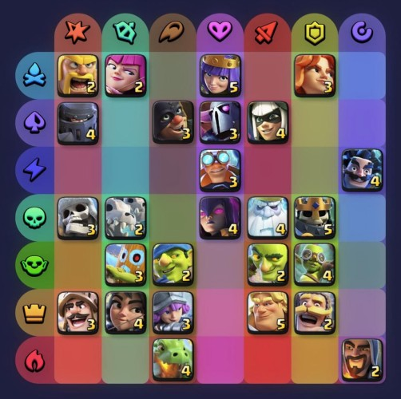

# Merge Tactics Calculator — README

1. [Introduction 🎯](#introduction-🎯)  
2. [Input Guide 🗣️](#input-guide-🗣️)  
3. [Technical Details 🤓](#technical-details-🤓)  

## Introduction 🎯
Welcome to the **Merge Tactics Calculator** for **Clash Royale Merge Tactics**!

The best teams in Merge Tactics are made of troops that share many traits. The image below shows all troops, with rows and columns representing each troop's traits. This calculator takes your current troops, generates all possible teams, scores them by active traits, and displays the **top-scoring teams**.



## Input Guide 🗣️
Here’s how to tell the calculator what you want:

| Input Type | Syntax | Example | What it does |
|-------------|---------|----------|--------------|
| Troop | lowercase | `archer` | Makes sure this troop is included in your team |
| Exclude troop | `!` + lowercase | `!archer` | Makes sure this troop **does not** appear in the team |
| Trait | UPPERCASE | `CLAN` | Requires **2** troops with this trait |
| Trait with count | number + UPPERCASE | `4CLAN` | Requires the given number of this trait |
| Exclude trait | `!` + UPPERCASE | `!CLAN` | Prohibits **2** troops with this trait |
| Exclude trait with count | `!` + number + UPPERCASE | `!4CLAN` | Prohibits the given number of this trait |
| Trait dummy | UPPERCASE + `:` + UPPERCASE | `FIRE:BRAWL` | Adds a dummy troop with both traits (counts toward trait scoring) |
| Team size | number | `7` | Sets the team size (default 6) |
| Sort ascending by cost | `-ascending` | `-a` | When scores tie, prefers lower-cost teams |
| Sort descending by cost | `-descending` | `-d` | When scores tie, prefers higher-cost teams |
| Display count | `-` + number | `-10` | How many top teams to show (default 10) |
| Brute force | `-bruteforce` | `-b` | Search all troop combinations instead of only those with shared traits |

### Example Input
```
barb !goldenknight FIRE:BRAWL 4NOBLE
```
- Includes `barbarian`  
- Excludes `goldenknight`  
- Adds a trait dummy with `FIRE` and `BRAWLER`  
- Requires at least 4 troops with the `NOBLE` trait  

### Notes
- You **can leave the input blank**, and it will search for all possible teams.  
- **Prefixes can be used** for all words in the input. For example, `"arch"` will match `"archer"` and `"CL"` can match `"CLAN"`.
- Trait dummy counts toward scoring.  

### Scoring System
- **2 troops sharing a trait** → 2 points  
- **4 troops sharing a trait** → 5 points  
- **6 troops sharing a trait** → 10 points 

## Technical Details 🤓

A behind-the-scenes look at how this calculator works, with optimizations that keep it fast and accurate:

### 1. Parsing Your Input
- Handles troops, excluded troops, traits, trait counts, and trait dummies  
- Handles team size, sorting rules, result count, and brute force mode  
- Builds sets and dictionaries to keep track of everything efficiently

### 2. Fast Lookups with Tries
**Trie structures** are used to quickly find troops and traits from the input.  
- Supports prefixes and aliases  
- Typing `"arch"` will still match `"archer"`  
- Speeds up input parsing significantly

### 3. Building Teams
Two approaches are used to generate potential teams:

#### a) Brute Force Mode
- Loops through **all possible combinations** of available troops  
- Guarantees every valid team is checked  
- Great for small team sizes, but can get slow for bigger teams

#### b) Greedy / Graph-Based Mode
- Connects troops in a graph if they share traits  
- Uses a **backtracking algorithm** to find all connected groups of the desired size  
- Only explores troops that actually share traits, which is faster than brute force  
- Prioritizes teams with strong trait synergy

### 4. Pruning Teams
After generating candidates, teams that:
- Don’t meet the **wanted trait counts**  
- Exceed **excluded trait limits**  

are removed. This ensures only valid teams are considered.

### 5. Scoring Teams
Each team calculates:
- **Trait counts** (including dummies)  
- **Score** based on active trait bonuses (2 → 2 pts, 4 → 5 pts, 6+ → 10 pts)  
- **Total elixir cost**  
- **Meta ranking** (predefined troop priority)

All of this is stored efficiently using Python’s `__slots__`.

### 6. Sorting & Picking the Best
- `heapq.nlargest` is used to grab the top N teams quickly  
- Sorting is by score, then cost (ascending/descending if specified), then meta ranking (a subjective ordering of troop strength in the current meta)

### 7. Displaying Teams
- Shows troop images (sorted by cost)  
- Trait icons with counts  
- Elixir cost and total score  
- Trait dummy overlay if one is added  
- Clean HTML layout for easy browsing

### 8. Performance Notes
- Trie lookups are very fast (basically O(input length))  
- Graph-based connected subgraph search is much faster than checking all combinations  
- Brute force is available as an option if every possible team needs to be considered  
- Benchmarks show graph-based search is orders of magnitude faster than naive approaches for normal team sizes

**TL;DR:** Combines **tries**, **graph-based backtracking**, and **heap selection** to produce fast, accurate, high-scoring team suggestions.